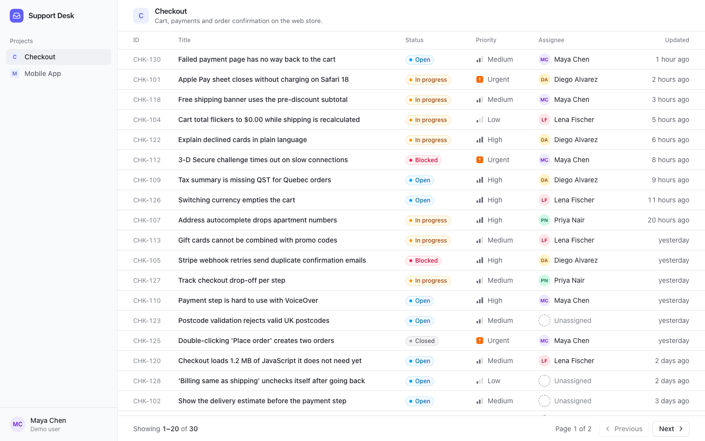

# Support Desk

A small ticket tracker for product teams, and the starter project for the
**Agentic Development in Cursor** course. During the day we build the features in
[`docs/features`](docs/features) on top of it with Cursor's agent.



## Quick start

```bash
nvm use               # Node 24
npm ci
npm run setup:check   # prints PASS/FAIL for Node, install, database, API and browser
npm run dev           # API on http://localhost:8787, web on http://localhost:5173
```

There is no login: every request acts as the demo user **Maya Chen**, who belongs to
Checkout and Mobile App but not Internal Tools.

## Commands

| Command               | What it does                                           |
| --------------------- | ------------------------------------------------------ |
| `npm run dev`         | API and web together, with reload                      |
| `npm run db:seed`     | Reset the local database to the demo data (70 tickets) |
| `npm test`            | Unit and integration tests (Vitest)                    |
| `npm run test:e2e`    | End-to-end smoke test (Playwright)                     |
| `npm run check`       | Biome, TypeScript and unit tests: run before you push  |
| `npm run format`      | Format and fix everything with Biome                   |
| `npm run setup:check` | Verify a fresh machine is ready                        |

## Architecture

```
apps/web         React 19 · Vite · Tailwind CSS · TanStack Query · React Router
   │  fetch /api  (Vite proxies to the API in dev)
   ▼
apps/api         Hono: routes → services → repositories
   │  Drizzle ORM
   ▼
SQLite           apps/api/data/support-desk.db  (in-memory in tests)

packages/shared  zod schemas and types, imported by both apps
```

- **API**: every project route goes through one access rule (`apps/api/src/auth/access.ts`).
  Hidden and missing projects return the same 404. Errors always look like
  `{ "error": { "code": "...", "message": "..." } }`.
- **Web**: a typed fetch client validates every response with the shared schemas.
  List state (like the page) lives in the URL.

See [`AGENTS.md`](AGENTS.md) for conventions and [`docs/features`](docs/features) for
the live-session tickets.
